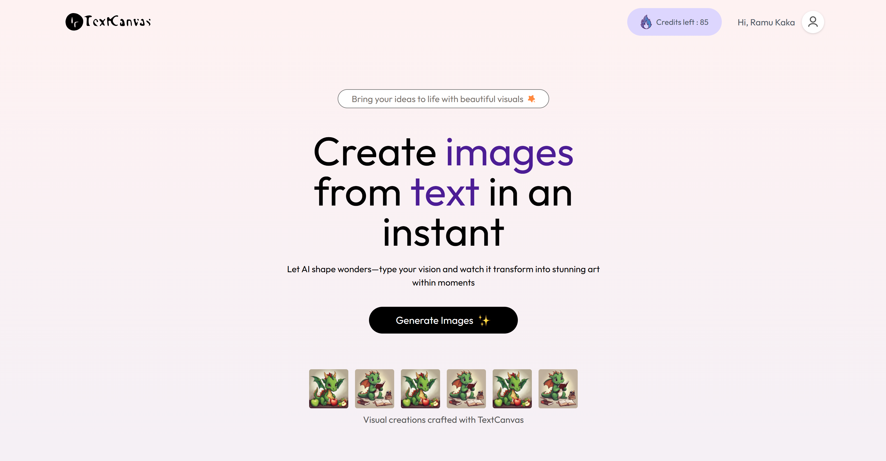
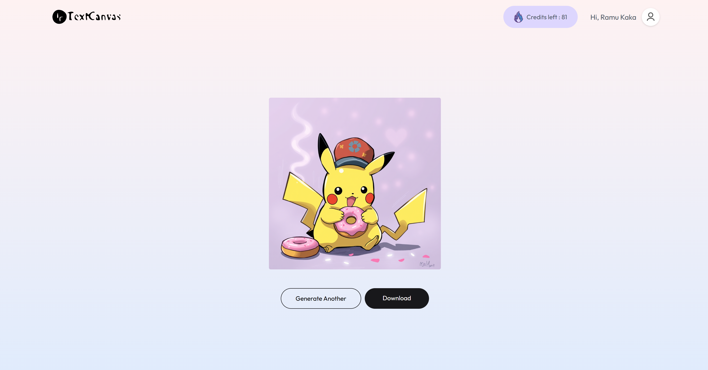
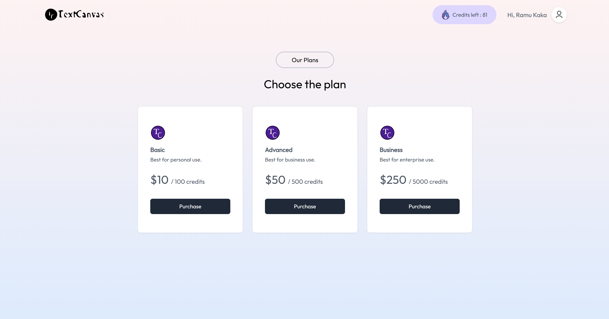
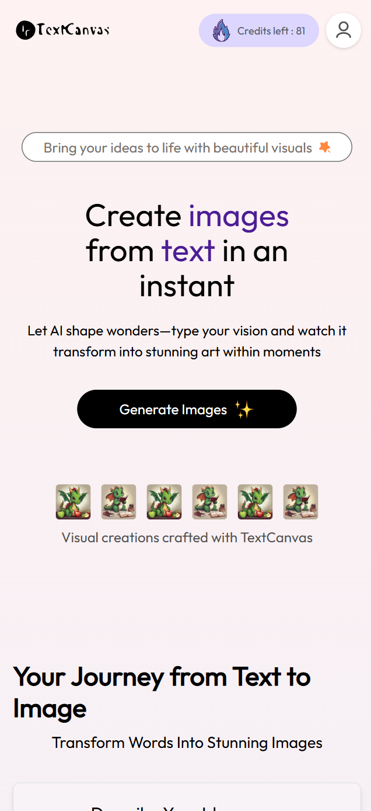

<p align="center">
  
</p>

# 🎨 TextCanvas  
_AI-Powered Text-to-Image Generator built with MERN stack_


---

<p align="center">
  
</p>

---

## ✨ Features

- 🖼️ **Text-to-Image** – Generate AI-powered visuals from text prompts  
- 🎨 **Multiple Styles** – Choose between realistic & artistic styles  
- 🔒 **Authentication** – Secure login/register with JWT  
- 💳 **Payments** – Razorpay integration for credits  
- 📊 **User Dashboard** – Track credits & generation history  
- 📱 **Responsive UI** – Works on desktop & mobile  
- ⚡ **Fast Performance** – Optimized backend + Clipdrop API  

---

## 🛠 Tech Stack

- **Frontend**: React, Vite, Tailwind CSS, Framer Motion, React Router, Axios  
- **Backend**: Node.js, Express.js, MongoDB, Mongoose  
- **Auth**: JWT (JSON Web Tokens)  
- **Payments**: Razorpay  
- **AI Engine**: Clipdrop API  

---

## 📦 Prerequisites

- Node.js `16+`  
- npm or yarn  
- MongoDB Atlas account (or local MongoDB)  
- Clipdrop API key  
- Razorpay API keys  

---

## 🚀 Getting Started

### 1️⃣ Clone the repository  

```bash
git clone https://github.com/sujal-chauhan/TextCanvas-AI-image-generation-app.git
cd TextCanvas
```

### 2️⃣ Setup Client

```bash
cd client
npm install
```
Create a **`.env`** file in `/client`:

```env
VITE_API_BASE_URL=http://localhost:5000/api
VITE_RAZORPAY_KEY=your_razorpay_key
```
Start the dev server

```bash
npm run dev
```

### 3️⃣ Setup Server

```bash
cd ../server
npm install
```

Create a **`.env`** file in `/server`:
```env
PORT=5000
MONGODB_URI=your_mongodb_uri
JWT_SECRET=your_jwt_secret
CLIPDROP_API_KEY=your_clipdrop_api_key
RAZORPAY_KEY_ID=your_razorpay_key_id
RAZORPAY_KEY_SECRET=your_razorpay_secret
```

Run server
```bash
npm start
```

👉 Client: http://localhost:5173
👉 API: http://localhost:5000/api

---

## 📂 Project Structure
```bash
text-canvas/
├── client/                  # React frontend
│   ├── public/              # Static files
│   └── src/
│       ├── assets/          # Icons & images
│       ├── components/      # Reusable UI
│       ├── context/         # Global state
│       ├── pages/           # Routes
│       ├── App.jsx
│       └── main.jsx
│
└── server/                  # Node.js backend
    ├── config/             # DB & env config
    ├── controllers/        # Route handlers
    ├── middlewares/        # Auth middleware
    ├── models/             # Mongoose models
    ├── routes/             # API endpoints
    └── server.js           # App entry point
```

---

## 📸 Screenshots

### 🏠 Full Size Homepage
<p align="center"> 
   
</p>

### ✍️ Prompt Input & Generated Result
<p align="center"> 
   
</p>

### 📊 Plans & Pricing
<p align="center"> 
   
</p>

### 📱 Mobile View
<p align="center"> 
   
</p>

---

## 🔑 API Endpoints

### Auth
- **POST** `/api/auth/register` → Register  
- **POST** `/api/auth/login` → Login  
- **GET** `/api/auth/me` → Get user  

### Images
- **POST** `/api/images/generate` → Generate image  
- **GET** `/api/images/history` → Get history  

### Payments
- **POST** `/api/payments/create-order` → Create order  
- **POST** `/api/payments/verify` → Verify payment  

---

## 🙏 Acknowledgments

- [Clipdrop](https://clipdrop.co/) – AI image generation  
- [Razorpay](https://razorpay.com/) – Payments  
- [Tailwind CSS](https://tailwindcss.com/) – Styling  
- [Framer Motion](https://www.framer.com/motion/) – Animations

---

## 🙃 Half code, half chaos — by [Sujal Chauhan](https://github.com/sujal-chauhan)  
